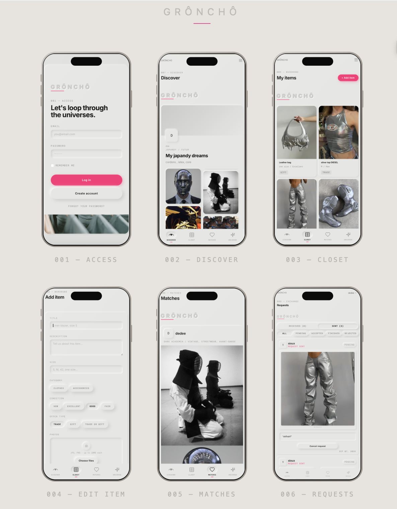

<p align="center">
  
</p>

<p align="center">
  
  
  
  
  <img src="data:image/svg+xml;base64,PHN2ZyBmaWxsPSIjNDQ3OUExIiBjbGFzcz0iaWMtbXlzcWwiIHhtbG5zPSJodHRwOi8vd3d3LnczLm9yZy8yMDAwL3N2ZyIgdmlld0JveD0iMCAwIDI0IDI0Ij48dGl0bGU+TXlTUUw8L3RpdGxlPjxwYXRoIGQ9Ik0xNi40MDUgNS41MDFjLS4xMTUgMC0uMTkzLjAxNC0uMjc0LjAzM3YuMDEzaC4wMTRjLjA1NC4xMDQuMTQ2LjE4LjIxNC4yNzMuMDU0LjEwNy4xLjIxNC4xNTQuMzJsLjAxNC0uMDE1Yy4wOTQtLjA2Ni4xNC0uMTcyLjE0LS4zMzMtLjA0LS4wNDctLjA0Ni0uMDk0LS4wOC0uMTQtLjA0LS4wNjctLjEyNi0uMS0uMTgtLjE1M3pNNS43NyAxOC42OTVoLS45MjdhNTAuODU0IDUwLjg1NCAwIDAwLS4yNy00LjQxaC0uMDA4bC0xLjQxIDQuNDFIMi40NWwtMS40LTQuNDFoLS4wMWE3Mi44OTIgNzIuODkyIDAgMDAtLjE5NSA0LjQxSDBjLjA1NS0xLjk2Ni4xOTItMy44MS40MS01LjUzaDEuMTVsMS4zMzUgNC4wNjRoLjAwOGwxLjM0Ny00LjA2NGgxLjA5NWMuMjQyIDIuMDE1LjM4NCAzLjg2LjQyOCA1LjUzem00LjAxNy00LjA4Yy0uMzc4IDIuMDQ1LS44NzYgMy41MzMtMS40OTIgNC40Ni0uNDgyLjcxNi0xLjAxIDEuMDczLTEuNTgzIDEuMDczLS4xNTMgMC0uMzQtLjA0Ni0uNTY2LS4xMzh2LS40OTRjLjExLjAxNy4yNC4wMjYuMzg2LjAyNi4yNjggMCAuNDgzLS4wNzUuNjQ3LS4yMjIuMTk3LS4xOC4yOTUtLjM4Mi4yOTUtLjYwNSAwLS4xNTUtLjA3Ny0uNDctLjIzLS45NDRMNi4yMyAxNC42MTVoLjkxbC43MjcgMi4zNmMuMTY0LjUzNi4yMzMuOTEuMjA1IDEuMTIzLjQtMS4wNjQuNjc4LTIuMjI3LjgzNS0zLjQ4M3ptMTIuMzI1IDQuMDhoLTIuNjN2LTUuNTNoLjg4NXY0Ljg1aDEuNzQ1em0tMy4zMi4xMzVsLTEuMDE2LS41Yy4wOS0uMDc2LjE3Ny0uMTU4LjI1NS0uMjUuNDMzLS41MDYuNjQ4LTEuMjU4LjY0OC0yLjI1MyAwLTEuODMtLjcxOC0yLjc0Ni0yLjE1NS0yLjc0Ni0uNzA0IDAtMS4yNTQuMjMyLTEuNjUuNjk3LS40My41MDgtLjY0NiAxLjI1Ni0uNjQ2IDIuMjQ1IDAgLjk3Mi4xOSAxLjY4Ni41NzQgMi4xNC4zNS40MS44NzcuNjE1IDEuNTgzLjYxNS4yNjQgMCAuNTA2LS4wMzMuNzI1LS4wOThsMS4zMjUuNzcyLjM2LS42MjJ6TTE1LjUgMTcuNTg4Yy0uMjI1LS4zNi0uMzM3LS45NC0uMzM3LTEuNzM2IDAtMS4zOTMuNDI0LTIuMDkgMS4yNy0yLjA5LjQ0MyAwIC43Ny4xNjcuOTc3LjUuMjI0LjM2Mi4zMzYuOTM2LjMzNiAxLjcyMyAwIDEuNDA0LS40MjQgMi4xMDgtMS4yNyAyLjEwOC0uNDQ1IDAtLjc3LS4xNjctLjk3OC0uNXptLTEuNjU4LS40MjVjMCAuNDcuMTcyLjg1Ni0uNTE2IDEuMTU2LS4zNDQuMy0uODAzLjQ1LTEuMzg0LjQ1LS41NDMgMC0xLjA2NC0uMTcyLTEuNTczLS41MTVsLjIzNy0uNDc2Yy40MzguMjIuODMzLjMyOCAxLjE5LjMyOC4zMzIgMCAuNTkzLS4wNzMuNzgzLS4yMmEuNzU0Ljc1NCAwIDAwLjMtLjYxNWMwLS4zMy0uMjMtLjYxLS42NDgtLjg0NS0uMzg4LS4yMTMtMS4xNjMtLjY1Ny0xLjE2My0uNjU3LS40MjItLjMwNy0uNjMyLS42MzYtLjYzMi0xLjE3NyAwLS40NS4xNTctLjgxLjQ3LTEuMDg1LjMxNS0uMjc4LjcyLS40MTUgMS4yMi0uNDE1LjUxMiAwIC45OC4xMzYgMS40LjQxbC0uMjEzLjQ3NmEyLjcyNiAyLjcyNiAwIDAwLTEuMDY0LS4yM2MtLjI4MyAwLS41MDIuMDY4LS42NTQuMjA2YS42ODUuNjg1IDAgMDAtLjI0OC41MjRjMCAuMzI4LjIzNC42MS42NjYuODUuMzkzLjIxNSAxLjE4Ny42NyAxLjE4Ny42Ny40MzMuMzA1LjY0OC42My42NDggMS4xNjh6bTkuMzgyLTUuODUyYy0uNTM1LS4wMTQtLjk1LjA0LTEuMjk3LjE4OC0uMS4wNC0uMjYuMDQtLjI3NC4xNjcuMDU1LjA1My4wNjMuMTQuMTEuMjE0LjA4LjEzNC4yMTguMzEzLjM0Ni40MDcuMTQuMTEuMjguMjE2LjQyNy4zMS4yNi4xNi41NTUuMjU1LjgxLjQxNi4xNDUuMDk0LjI5My4yMTMuNDQuMzEzLjA3My4wNS4xMi4xNC4yMTQuMTcydi0uMDJjLS4wNDYtLjA2LS4wNi0uMTQ3LS4xMDUtLjIxNC0uMDY3LS4wNjctLjEzNC0uMTI3LS4yLS4xOTNhMy4yMjMgMy4yMjMgMCAwMC0uNjk1LS42NzVjLS4yMTQtLjE0Ni0uNjgyLS4zNS0uNzctLjU5NWwtLjAxMy0uMDE0Yy4xNDYtLjAxMy4zMi0uMDY2LjQ2LS4xMDYuMjI3LS4wNi40MzUtLjA0Ny42Ny0uMTA2LjEwNi0uMDI3LjIxMy0uMDYuMzItLjA5NHYtLjA2Yy0uMTItLjEyLS4yMS0uMjgzLS4zMzQtLjM5NWE4Ljg2NyA4Ljg2NyAwIDAwLTEuMTA0LS44MjNjLS4yMS0uMTM0LS40NzYtLjIyLS42OTctLjMzNC0uMDgtLjA0LS4yMTQtLjA2LS4yNi0uMTI3LS4xMi0uMTQ2LS4xOS0uMzQtLjI3NS0uNTE0YTE3LjY5IDE3LjY5IDAgMDEtLjU0Ny0xLjE2M2MtLjEyLS4yNjItLjE5My0uNTIzLS4zNC0uNzYzLS42OS0xLjEzNy0xLjQzNy0xLjgyNi0yLjU4Ni0yLjUtLjI0Ny0uMTQtLjU0My0uMi0uODU2LS4yNzQtLjE2Ny0uMDA4LS4zMzQtLjAyLS41LS4wMjctLjExLS4wNDctLjIxNi0uMTc0LS4zMS0uMjM1LS4zOC0uMjQtMS4zNjQtLjc2LTEuNjQ0LS4wNzItLjE4LjQzNC4yNjcuODYyLjQyMiAxLjA4Mi4xMTUuMTUzLjI2LjMyOC4zNC41LjA0Ny4xMTYuMDYuMjM1LjEwNy4zNTYuMTA2LjI5NC4yMDcuNjIyLjM0Ny44OTcuMDczLjE0LjE1My4yODcuMjQ3LjQxMy4wNTQuMDczLjE0Ni4xMDcuMTY3LjIyNy0uMDk0LjEzNi0uMS4zMzQtLjE1NC41LS4yNC43NTctLjE0NiAxLjY5My4xOTQgMi4yNS4xMDcuMTY2LjM2Mi41MzQuNzAzLjM5My4zLS4xMi4yMzQtLjUuMzItLjgzNS4wMi0uMDguMDA3LS4xMzMuMDQ4LS4xODd2LjAxNWMuMDk0LjE4OC4xODguMzY3LjI3NC41NTUuMjA2LjMyOC41NjYuNjY4Ljg2Ny44OTUuMTYuMTIuMjg3LjMyOC40ODcuNDAydi0uMDJoLS4wMTVjLS4wNDMtLjA1OC0uMS0uMDg2LS4xNTQtLjEzM2EzLjQ0NSAzLjQ0NSAwIDAxLS4zNS0uNCA4Ljc2IDguNzYgMCAwMS0uNzQ3LTEuMjE4Yy0uMTEtLjIxLS4yMDItLjQzNi0uMjktLjY0My0uMDQtLjA4LS4wNC0uMi0uMTA3LS4yNC0uMS4xNDYtLjI0Ny4yNzMtLjMyLjQ1My0uMTI3LjI4OC0uMTQuNjQyLS4xODggMS4wMS0uMDI3LjAwNy0uMDE0IDAtLjAyNy4wMTQtLjIxNC0uMDUyLS4yODctLjI3NC0uMzY3LS40Ni0uMi0uNDc1LS4yMzMtMS4yMzgtLjA2LTEuNzg1LjA0Ny0uMTQuMjQ3LS41ODIuMTY3LS43MTYtLjA0Mi0uMTI3LS4xNzQtLjItLjI0Ny0uMzAzYTIuNDc4IDIuNDc4IDAgMDEtLjI0LS40MjdjLS4xNi0uMzc0LS4yNC0uNzg4LS40MTQtMS4xNjItLjA4LS4xNzMtLjIyLS4zNTQtLjMzNC0uNTEzLS4xMjctLjE4LS4yNjctLjMwNy0uMzY4LS41Mi0uMDMzLS4wNzMtLjA4LS4xOTQtLjAyNy0uMjc0LjAxNC0uMDU0LjA0Mi0uMDc1LjA5NC0uMDkuMDg4LS4wNzIuMzM1LjAyMi40MjIuMDYyLjI0Ny4xLjQ1NS4xOTQuNjYyLjMzNC4wOTQuMDY2LjE5NS4xOTMuMzE1LjIyNmguMTRjLjIxNC4wNDcuNDU1LjAxNC42NTUuMDczLjM1NS4xMTQuNjc1LjI4Ljk2Mi40NmE1Ljk1MyA1Ljk1MyAwIDAxMi4wODUgMi4yODZjLjA4LjE1NC4xMTUuMjk1LjE4OC40NTUuMTQuMzMuMzEzLjY2My40NTUuOTgyLjE0LjMxNS4yNzUuNjM2LjQ3Ni44OTcuMS4xNC41MDIuMjEzLjY4Mi4yODYuMTMzLjA2LjM0LjExNS40Ni4xODguMjMuMTQuNDU0LjMuNjcuNDU0LjExLjA3Ni40NDMuMjQzLjQ2My4zNzh6Ii8+PC9zdmc+" alt="MySQL" height="22">
</p>

A clothing and accessories swap & gift app, with no money involved. Each user builds their own **universe** — an aesthetic profile with a moodboard and a style — and discovers other profiles by swiping through them. When the like is mutual, a **match** is created, unlocking access to each other's wardrobe so they can request trades or gifts.

## 001 — Features
- **Universe**: create and edit an aesthetic profile (name, description, style) with a photo moodboard
- **Wardrobe**: full CRUD for items (garments/accessories), with photos, condition, category and offer type (trade / gift / both)
- **Discover**: swipe (like / nope) over other users' universes
- **Match**: a mutual like unlocks each other's wardrobe
- **Exchanges**: request a trade or a gift on a matched user's item, with an accept / reject / finish flow
- Data integrity backed by native PHP enums for item and exchange status/type fields, instead of magic strings

## 002 — Core flow
swipe → mutual like → match → exchange request → accepted / rejected / finished

## 003 — Main entities
`users` · `universes` · `universe_images` · `items` · `item_images` · `swipes` · `matches` · `exchanges`

The two full CRUDs in this project are **Items** (garments) and **Exchanges** (trade/gift requests).

## 004 — Data model


## 005 — Stack
- Backend: Laravel 13 (PHP 8.5), Livewire
- Frontend: Blade, Tailwind CSS
- Database: MySQL

## 006 — Installation
1. Clone the repository: `git clone https://github.com/DCdiegocortes/sprint04_laravel_Lv01_groncho_app.git`
2. Install PHP dependencies: `composer install`
3. Install frontend dependencies: `npm install`
4. Environment variables: copy `.env.example` to `.env` and fill in the MySQL connection:
   ```
   DB_CONNECTION=mysql
   DB_HOST=127.0.0.1
   DB_PORT=3306
   DB_DATABASE=groncho_app
   DB_USERNAME=root
   DB_PASSWORD=
   ```
5. Generate the app key: `php artisan key:generate`
6. Create the tables and seed test data: `php artisan migrate --seed`
7. Link storage so uploaded photos work: `php artisan storage:link`
8. Start the server: `php artisan serve`
9. Compile the assets: `npm run dev`

## 007 — Demo


## 008 — UI Design

