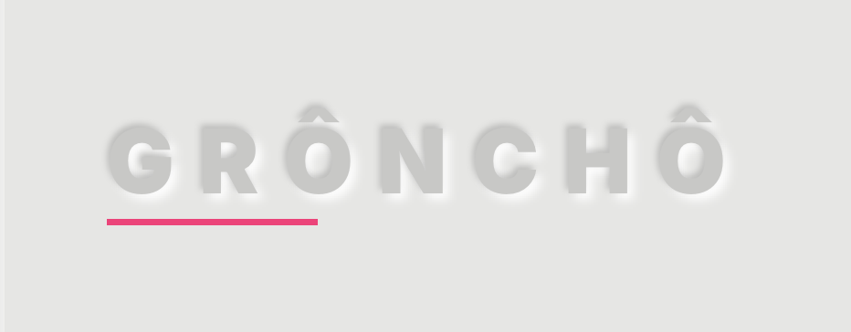
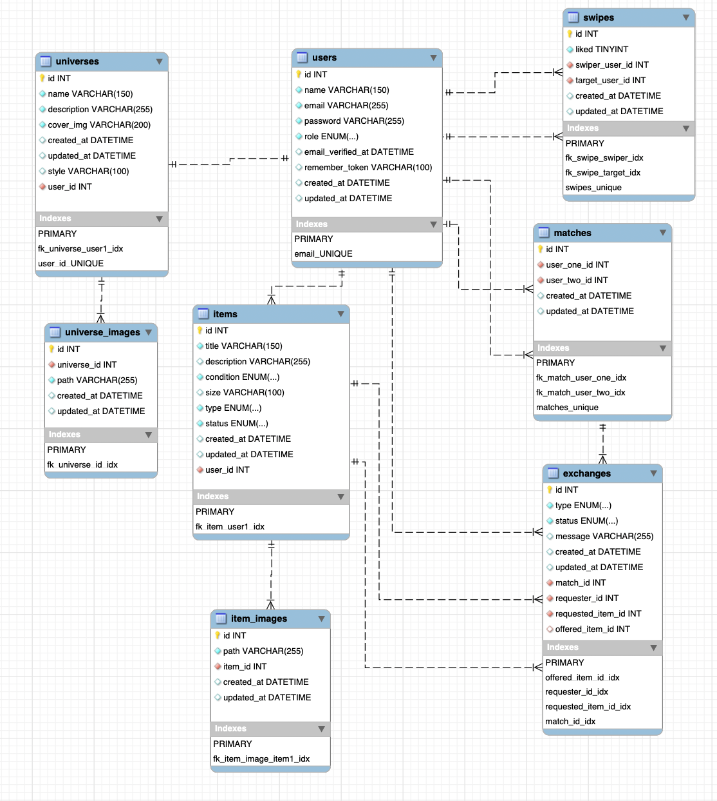
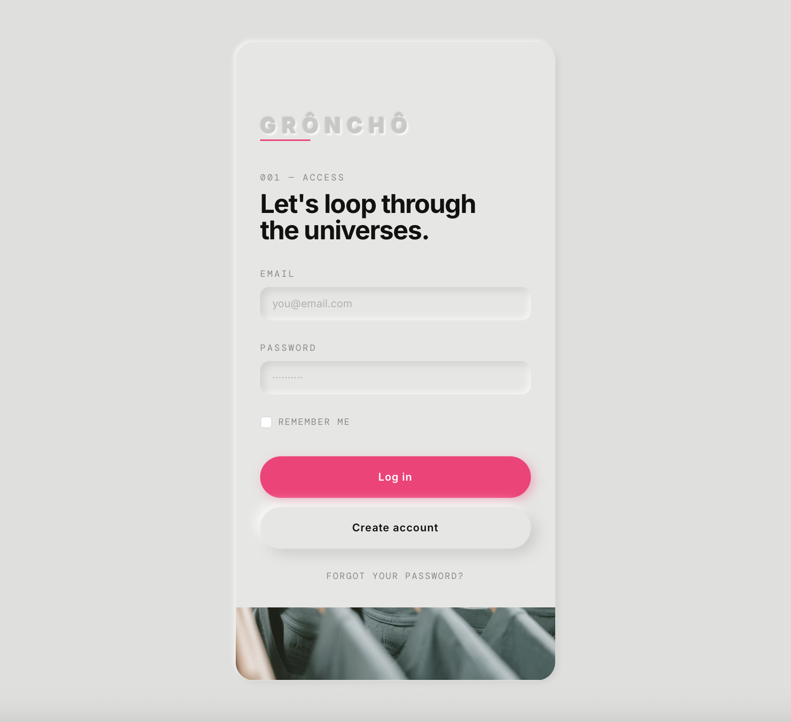
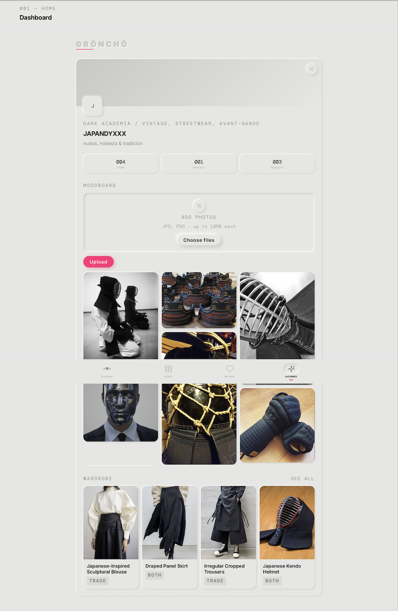
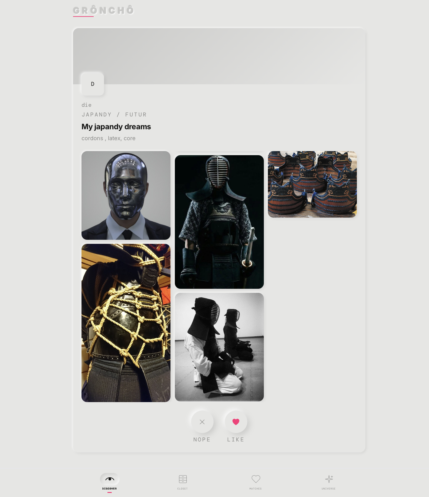
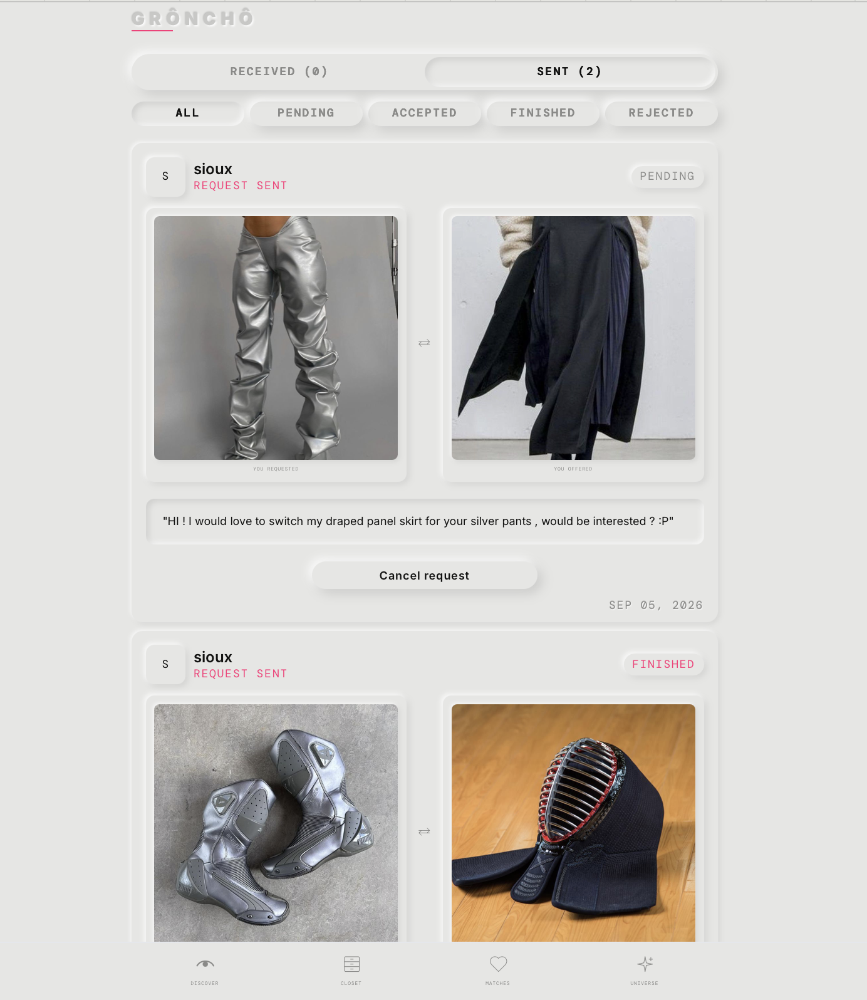
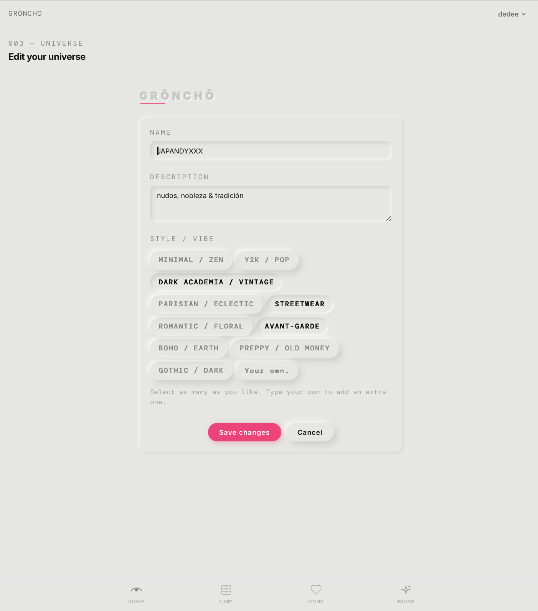

<p align="center">
  
</p>

<p align="center">
  
  
  
  
  
</p>

A clothing and accessories swap & gift app, with no money involved. Each user builds their own **universe** — an aesthetic profile with a moodboard and a style — and discovers other profiles by swiping through them. When the like is mutual, a **match** is created, unlocking access to each other's wardrobe so they can request trades or gifts.

## 001 — Features
- **Universe**: create and edit an aesthetic profile (name, description, style) with a photo moodboard
- **Wardrobe**: full CRUD for items (garments/accessories), with photos, condition, category and offer type (trade / gift / both)
- **Discover**: swipe (like / nope) over other users' universes
- **Match**: a mutual like unlocks each other's wardrobe
- **Exchanges**: request a trade or a gift on a matched user's item, with an accept / reject / finish flow
- Data integrity backed by native PHP enums for item and exchange status/type fields, instead of magic strings

## 002 — Core flow
swipe → mutual like → match → exchange request → accepted / rejected / finished

## 003 — Main entities
`users` · `universes` · `universe_images` · `items` · `item_images` · `swipes` · `matches` · `exchanges`

The two full CRUDs in this project are **Items** (garments) and **Exchanges** (trade/gift requests).

## 004 — Data model


## 005 — Stack
- Backend: Laravel 13 (PHP 8.5), Livewire
- Frontend: Blade, Tailwind CSS
- Database: MySQL

## 006 — Installation
1. Clone the repository: `git clone https://github.com/DCdiegocortes/sprint04_laravel_Lv01_groncho_app.git`
2. Install PHP dependencies: `composer install`
3. Install frontend dependencies: `npm install`
4. Environment variables: copy `.env.example` to `.env` and fill in the MySQL connection:
   ```
   DB_CONNECTION=mysql
   DB_HOST=127.0.0.1
   DB_PORT=3306
   DB_DATABASE=groncho_app
   DB_USERNAME=root
   DB_PASSWORD=
   ```
5. Generate the app key: `php artisan key:generate`
6. Create the tables and seed test data: `php artisan migrate --seed`
7. Link storage so uploaded photos work: `php artisan storage:link`
8. Start the server: `php artisan serve`
9. Compile the assets: `npm run dev`

## 007 — Demo





